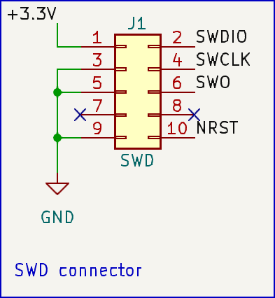

# Robotont mainboard firmware

Firmware for the Robotont platform mainboard.
Main tasks:
 * Movement control (Three PWM motors)
 * Addressable LED control
 * OLED screen control
 * Communication with the power management board
 * Serial communication handling
 
## Serial communication

The virtual serial port on the USB bus is used for bidirectional communication. Currently, it's the only way in the firmware to communicate with the external world (e.g. ROS). </br>
The following table refers to the available commands in the firmware:

|Type|Argument|Description|Format|
|---|---|---|---|
|Output|`ODOM`|Odometry data(*)|`"ODOM:{pos_x}:{pos_y}:{pos_z}:{speed_x}:{speed_y}:{speed_z}\r\n"`|
|Input|`RS`|Robot's x, y and rotation speed(*)|`"RS:{speed_x}:{speed_y}:{speed_z}\r\n"`|
|Input|`MS`|Individual motor speed(*)|`"MS:{speed_0}:{speed_1}:{speed_2}\r\n"`|
|Input|`DC`|Individual motor duty cycle(**)|`"DC:{motor_0}:{motor_1}:{motor_2}\r\n"`|
|Input|`OR`|Resets odometry data|`"OR\r\n"`|

(\*) *All speed units are arbitrary in range (-100:100).* </br>
(\*\*) *Robot will enter "manual mode", meaning that motors will rotate with a given duty cycle until `MS` or `RS` commands are received. The duty cycle range is (-100:100)%, where the minus mark means negative rotation direction. The threshold to stop is 10%.*

## Uploading

In order to flash new firmware, a programmer with the SWD interface is required.
Refer to the [robotont-electronics-mainboard](https://github.com/robotont/robotont-electronics-mainboard) schematic for detailed information.
<details>
  <summary>Pinout</summary>
  
</details>

## Development

The repository contains a PlatformIO project. PlatformIO is a development ecosystem for embedded systems and eases working on the code a lot.
All the dependencies and build tools are installed automatically on the first build. </br>

__If you are an active developer, please refer to the firmware documentation:__
 1. [Style guideline](./docs/style_guideline.md)
 2. [Firmware architecture](./docs/firmware_design.md)
 3. [How to add MCU peripherals](./docs/how_to_add_interfaces.md)

## Installation:

> [!NOTE]  
> It is highly recommended to use VSCode with PlatformIO extension in order to simplify the installation process.

#### VSCode

Navigate to the `robotont-firmware/.vscode/` and open `robotont.code-workspace` with VSCode. </br>
Install recommended extensions, they are included in the workspace file.

#### CLI

1. Install PlatformIO [CLI](https://docs.platformio.org/en/latest/core/installation.html).    
2. Make sure to add [the standard udev rules](https://docs.platformio.org/en/latest/faq.html#faq-udev-rules) of platformIO and also ST-link 2.1 specific ones:    
```curl -fsSL https://raw.githubusercontent.com/stlink-org/stlink/develop/config/udev/rules.d/49-stlinkv2-1.rules | sudo tee /etc/udev/rules.d/49-stlinkv2-1.rules```

To build and upload, in the project root, do
`pio run -t upload`


## FAQ

 1. Q: Using Linux, I am facing an issue `libusb_open() failed`. What commands I should run to solve it?</br>
    A:
    ```
    sudo apt -y install stlink-tools
    sudo systemctl restart udev
    ```
