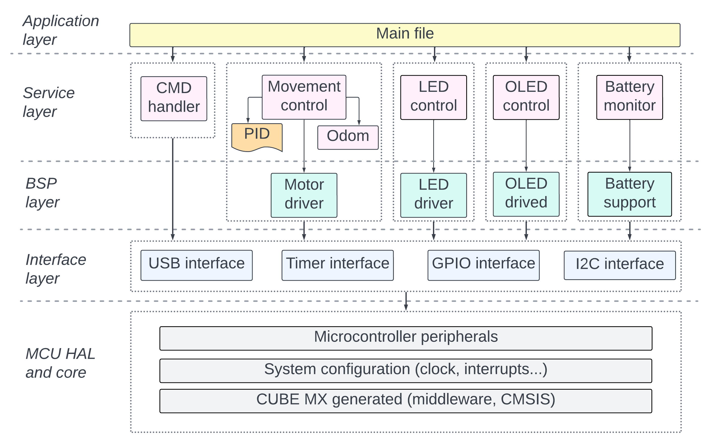

# Firmware architecture

This document contains all required information to start develop Robotont firmware.
Document divided into given sections:

- [Firmware architecture](#firmware-architecture)
  * [General overview](#general-overview)
      - [Abstraction layers](#abstraction-layers)
  * [Branching strategy (working with git)](#branching-strategy--working-with-git-)
  * [How to expand firmware](#how-to-expand-firmware)
  * [Limitations](#limitations)
  * [Formatting rules](#formatting-rules)

Before writing any code, please read it carefully. 

## General overview

In this project author used layered architecture approach. Firmware divided into separate abstraction layers. The higher layer is located, the less is depends on the project-specific hardware. Diagram should provide reader general understanding of firmware components and they dependencies.  
Each part of the diagram will be explained below.

  
   

#### Abstraction layers

Robotont firmware divided into the five layers:
|Layer|Description|
|---|---|
|Application layer|Highest level of abstraction. Defines, how different services of Robotont should cooperate. For example, if LED's should change color depending on motor speed, this logic should be specified in application layer|
|Service layer|Defines, what task (service) robot should be able to perform individually. Each service should contain own `update` function, that will be called in the application layer. Communication between services should be performed via getters and setters, avoid direct inclusion. (\*)|
|BSP layer|Board support package layer, also known as HW driver layer. Modules of this layer should provide basic interface to communicate with given hardware.|
|Interface layer|MCU peripheral interfaces, that wraps `STM32F4 HAL` functions. In this project, should be wrapped only used functions.|
|MCU HAL and core|MCU specific components, that were auto-generated by `STM32CubeMX` program.|

(\*) *Exception made for `cmd handler` service. `cmd handler` includes other services. Reason for this approach is that `cmd handler` only purpose is to redirect serial data. Moving this to the application layer will over-complicate the code.*

> [!IMPORTANT]  
> Bottom level module should never include module from top level. This approach will keep code more portable (not only in terms of MCU and HW, but also in terms of application).

#### Logical components

|Component|Description|
|---|---|
|Movement| In progress...|
|LED control|x|
|OLED control|x|
|Battery monitor|x|
|CMD handler|x|

## Limitations

## Branching strategy (working with git)

## How to expand firmware

Example: [how_to_add_interfaces.md](./how_to_add_interfaces.md)

// TODO example, how to add upp layer service

## Formatting rules

Rules: [style_guideline.md](./how_to_add_interfaces.md)
