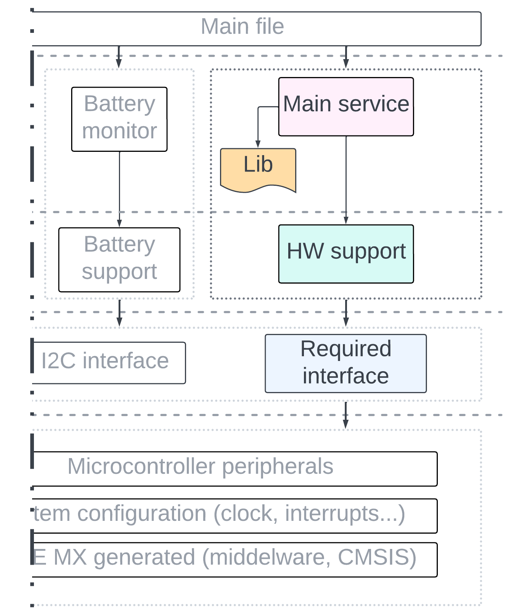

# Firmware architecture

- [Firmware architecture](#firmware-architecture)
   * [General overview](#general-overview)
   * [Application layer](#application-layer)
   * [Service layer](#service-layer)
   * [BSP layer](#bsp-layer)
   * [Interface layer](#interface-layer)
   * [MCU HAL and core](#mcu-hal-and-core)
   * [How to add features](#how-to-add-features)
   * [Limitations](#limitations)

## General overview

In this project, the author used a layered architecture approach. The firmware is divided into separate abstraction layers. The higher the layer's position, the less it depends on project-specific hardware.

Firmware design diagram and legend accordingly:
<p float="left">
  
   
</p>

Robotont firmware divided into the five layers:
|Layer|Brief description|
|---|---|
|Application layer|The highest level of abstraction. It defines how various services within Robotont should interact.|
|Service layer|Describes the tasks (or services) a robot should independently perform. Each service must include its own `update` function (non-blocking).|
|BSP layer|Board Support Package layer, also referred to as the Hardware Driver layer. Contains firmware drivers for specific hardware.|
|Interface layer| Wrapper over `STM32F4 HAL` functions. Provides simplified interface to communicate with MCU peripherals. Contains only used peripherals.|
|MCU HAL and core|MCU-specific components that were auto-generated by the `STM32CubeMX` program.|

> [!IMPORTANT]  
> The bottom-level module should never include modules from the top level. This approach will keep the code more portable, not only in terms of MCU and hardware but also in terms of application.

In repository, file tree looks like this:
```
lib/         - External libraries
src/         - Robotont project files
├─ app/          - Application layer files
├─ hw/           - BSP layer files
├─ mcu/          - Interface layer files
├─ stm-core/     - MCU HAL and core files, mostly generated
├─ svc/          - Service layer files
│  ├─ cfg/           - Service related config
```

## Application layer


</br>

The purpose of the application layer is to define how all services act together as a whole. Currently, Robotont has only one application component: the main file.

For example, if a developer wants to implement logic such as "If the battery monitor detects overvoltage, then the robot should not move," this is the right place to do so.

## Service layer


</br>

The purpose of the service layer is to define which tasks Robotont should perform. Each task (or service) is an individual component and should be independent. Communication with services should mostly be performed via getters and setters in the application layer.

Robotont have five services:
|Service|Description|
|---|---|
|CMD handler|Redirect serial data-in to the corresponding service. Refer to the [serial communication](./../README.md#serial-communication) for supported arguments. Additionally, the `printf` function is redirected here to serve as serial output.|
|Movement control|Calculates each motor speed based on Robotont's desired direction and speed for omnimotional movement. Additionally, calculates Robotont's odometry based on the robot's movement and prints it out to the serial bus.|
|LED control|Defines the behavior of addressable LEDs.|
|OLED control|Defines the behavior of the OLED screen, specifying what information to display on the screen.|
|Battery monitor|Communicates with the battery monitor hardware to check the status of the battery.|

</br>

Each service, which is called directly (not from an interrupt, such as the CMD handler), should contain its own <code>update</code> function in a non-blocking manner. The application layer will schedule itself how frequently each service should be updated.

With this approach, removing, adding, and changing tasks is significantly easier, as dependencies are hidden within one component.

## BSP layer


</br>

The purpose of the BSP layer (also referred to as the HW driver layer) is to provide drivers for Robotont's hardware components.

## Interface layer


</br>

The purpose of the interface layer is to isolate `STM32F4 HAL` functions from Robotont's application, which are used for communication with MCU peripherals.

This approach provides a significant advantage in terms of portability. If the MCU family and HAL framework undergo changes, developers need only modify the interface layer files, without editing upper layer files.

__See [How to add interfaces](how_to_add_interfaces.md) for detailed guide with examples.__

## MCU HAL and core

Mostly contains core files generated by `STM32CubeMX`. 

Manually created modules are:

- `peripheral`: Contains pin definitions, `HandleTypeDef`s, and MX peripheral initializations
- `system_hal`: Contains HAL module initialization, system clock configuration, and wrappers for `HAL_Delay` and `HAL_GetTick` functions.

The reason for those files to exist is that by default, the code generator stores them in `main.c`.

## How to add features

The whole point of the given firmware design is to simplify changes to Robotont's application. If a developer needs to add new functionality, they can simply do it "horizontally."



</br>

General steps are:
1. Define which interface is required.
2. [Optional] Add the interface; See [Interface layer](#interface-layer).
3. [Optional] Add a driver for the used hardware.
4. Add a service. If it's periodic, define an `update` function. If it's interrupt-based, define handlers.
5. [Optional] Add external library.
6. Call the `update` function in the main file.

## Limitations

In the `main.h` file, the main loop time period is defined. If the current value is 20 ms, for developers, this means that all service's `update` functions should complete within the 20 ms window in total (roughly 4ms per service).


