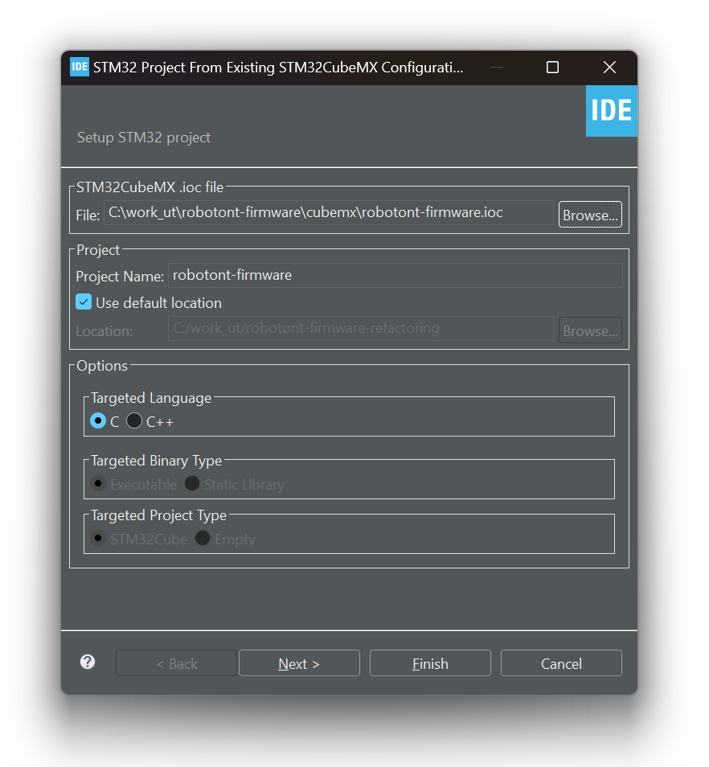
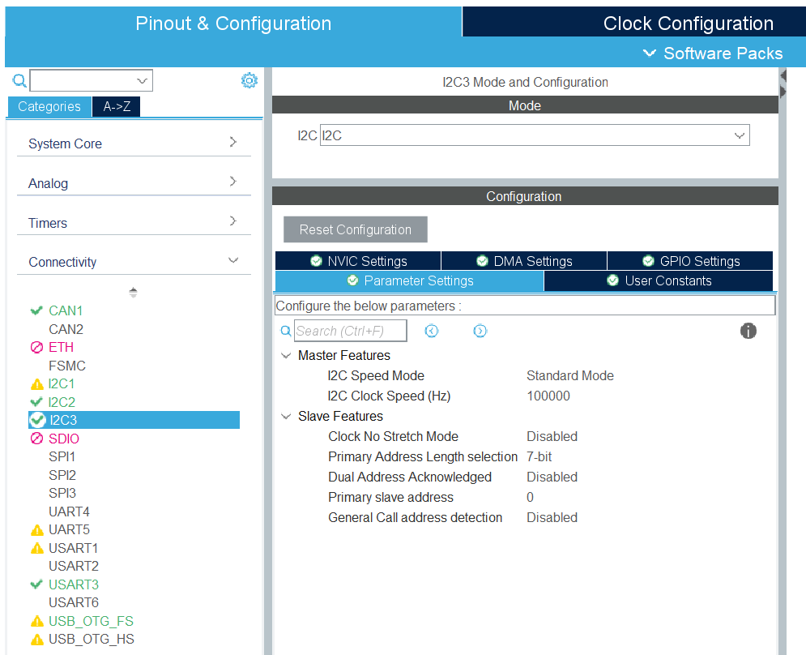
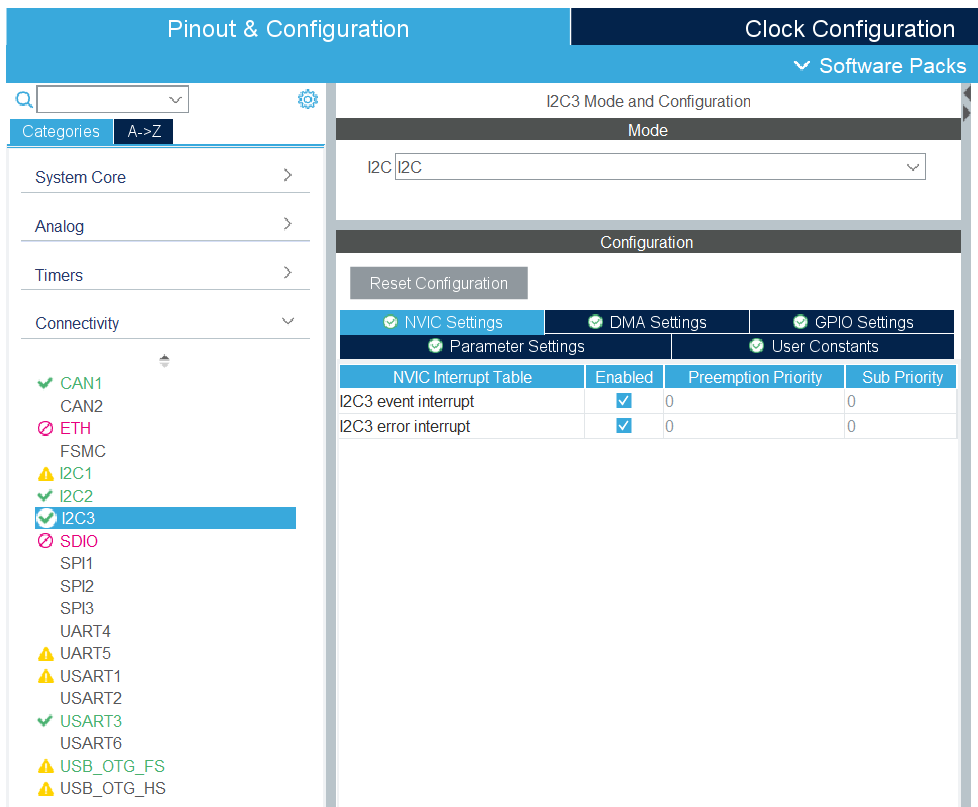
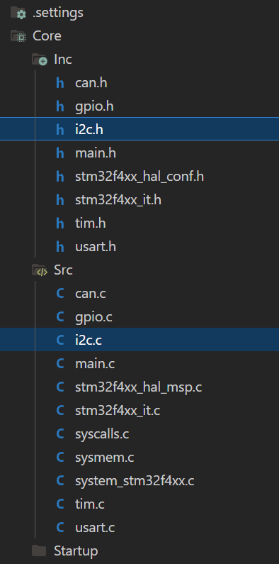
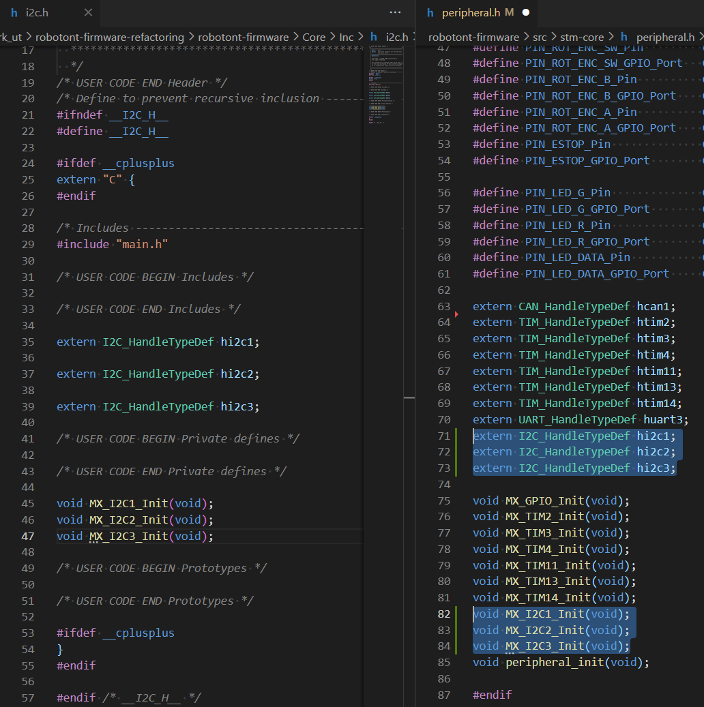
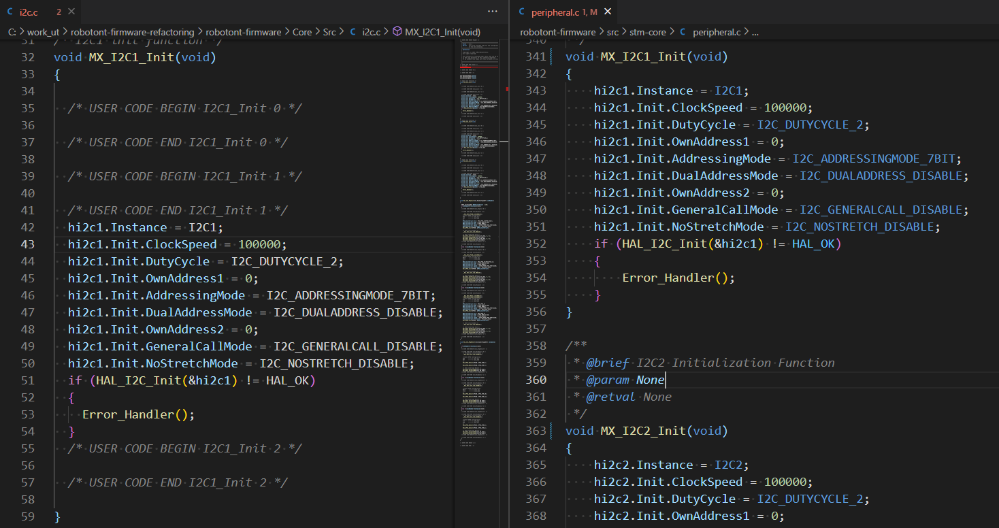
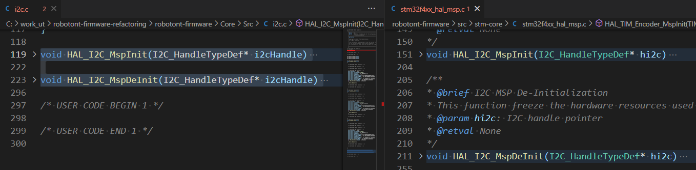
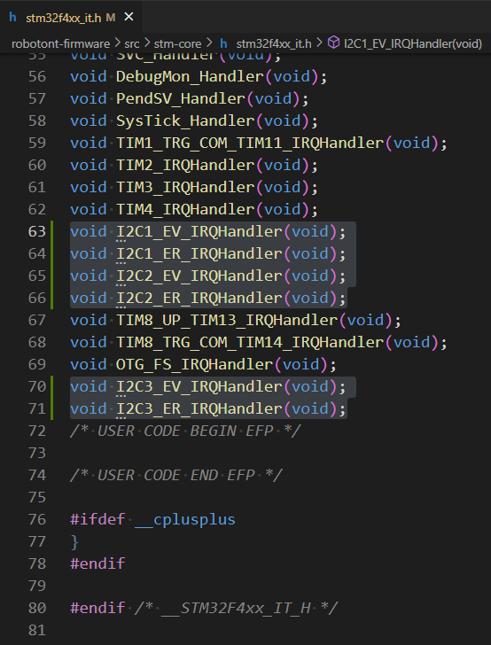
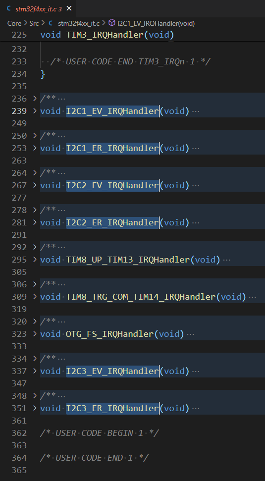

# How to add new MCU interfaces. Guide with I2C example.

This guide covers, how to extend MCU functionality, using STM32CubeMX code generator.
As an example, I2C configuration from zero will be provided.

## Cube MX configuration

In first steps, configure code generator:
 <details>
    <summary>1. Create new project, using repository .ioc file</br></summary>
    
  </details>

  <details>
    <summary>2. Enable interface with required setting; [Optional] Enable interrupts</br></summary>
      <p float="left">
        
         
      </p>
  </details>

  <details>
    <summary>3. Select "Copy only necessary..." and mark "Generate peripheral as a pair...":</br></summary>
      
  </details>


## Project configuration

> [!NOTE]  
> Keep track on those components:
> 1. Interface handler `I2C_HandleTypeDef hi2cx`
> 2. MX init function `MX_I2Cx_Init(void)`
> 3. HAL MSP init function `HAL_I2C_MspInit(I2C_HandleTypeDef hi2c)`
> 4. [Optional] Interrupt handlers `I2Cx_EV_IRQ_Handler(void)`, `I2Cx_ER_IRQ_Handler(void)`

In the next steps, copy required components to the project folder:
  <details>
    <summary>1. From <code>i2c.h</code></code> copy <code>I2C_HandleTypeDef hi2cX</code> and <code>MX_I2Cx_Init(void)</code> prototype to the <code>peripheral.h</code></code></br></summary>
    <p float="left">
      
       
    </p>
  </details> 
  
  <details>
    <summary>2. From <code>i2c.c</code> copy <code>MX_I2Cx_Init(void)</code> definition <code>peripheral.c</code></code></br></summary>
     
  </details> 

  <details>
    <summary>3. From <code>i2c.c</code> copy <code>HAL_I2C_MspInit(I2C_HandleTypeDef hi2c)</code> definition to the <code>stm32f4xx_hal_msp.c</code></br></summary>
    
  </details> 

  <details>
    <summary>4. [Optional] From <code>stm32f4xx_it.c/h</code> (generated) copy interrupts handlers (both prototypes and definitions) to the <code>stm32f4xx_it.c/h</code> (Robotont)</br></summary>
    <p float="left">
      
       
    </p>
  </details> 

Now developer can use `SMT32F4 HAL` functions for I2C interface (E.g. `HAL_I2C_Master_Transmit()`, `HAL_I2C_ErrorCallback()` etc...).


## Wrapper configuration (without interrupts)

We need to isolate generated `STM32F4 HAL` code from Robotont application. For this case, author creates simple `ic2if` module. </br>
Important to mention, that purpose of interface layer is to provide easy access for developers to the MCU peripheral. Therefore, configuration will be project-specific. In other words, we going to wrap only those functions, that are in use by Robotont. 

Since we use three I2C modules and only write data, we will wrap `MX_I2C1_Init();`, `MX_I2C2_Init();`, `MX_I2C3_Init();` and `HAL_I2C_Master_Transmit(...)`
```c
void i2cif_init(void)
{
    MX_I2C1_Init();
    MX_I2C2_Init();
    MX_I2C3_Init();
}

void i2cif_masterWrite(I2C_HandleTypeDef *i2c_handler, uint16_t slave_addr, uint8_t *ptr_data, uint16_t data_size, uint32_t timeout_ms)
{
    (void)HAL_I2C_Master_Transmit(i2c_handler, slave_addr, ptr_data, data_size, timeout_ms);
}
```

Now interface is ready to use. </br>
Let's pretend, that we have slave device on the I2C1 bus with the address 0xAB. Demo `main.c` file would look like this:
```c
#include <stdbool.h>
#include "i2cif.h"

// hi2c1 defined in "peripheral.h", but this file already included in the "i2cif.h"
#define I2C_HANDLER     (&hi2c1) 
#define I2C_TIMEOUT_MS  200u
#define I2C_SLAVE_ADDR  0xABu

void main(void)
{
    i2cif_init();

    uint8_t dummy_data[3u] = {0x12u, 0x34u, 0x56u};
    while(true)
    {
        i2cif_masterWrite(I2C_HANDLER, SLAVE_ADDR, dummy_data, 3u, I2C_TIMEOUT_MS);
    }
}
```

## Wrapper interrupt configuration

In current architecture is forbidden to include components from top to bottom layers. </br>
In order to follow this rule even with interrupts, that come from bottom layers, we can use [function pointers](https://www.cprogramming.com/tutorial/function-pointers.html).


We need to define interrupt, that we want to use. In this case it is `HAL_I2C_ErrorCallback()`. 
Also, we need to define callback setter, in this case it is `i2cif_setErrorCallback`.
```c
static FunctionPointerType error_callback = NULL; 

...
...

void i2cif_setErrorCallback(FunctionPointerType callback)
{
    error_callback = callback;
}

void HAL_I2C_ErrorCallback(I2C_HandleTypeDef *i2c_handler)
{
    if (error_callback != NULL)
    {
        error_callback(i2c_handler);
    }
}
```

Demo `main.c` file with I2C error handling would look like this:
```c
#include <stdbool.h>
#include <stdio.h>
#include "led.h"
#include "oled.h"

static void custom_error_handler(I2C_HandleTypeDef *i2c_handler);

void main(void)
{
    led_init();
    oled_init();
    FunctionPointerType error_callback = (FunctionPointerType)custom_error_handler;

    while(true)
    {
        oled_updateScreen(); // Using I2C transmission
    }
}

static void custom_error_handler(I2C_HandleTypeDef *i2c_handler)
{
    if (i2c_handler->Instance == OLED_I2C_INSTANCE)
    {
        printf("Error on the OLED I2C bus\r\n");
        led_setColor(LED_COLOR_RED);
        led_setMode(LED_MODE_BLINK_5HZ);
    }
}
```