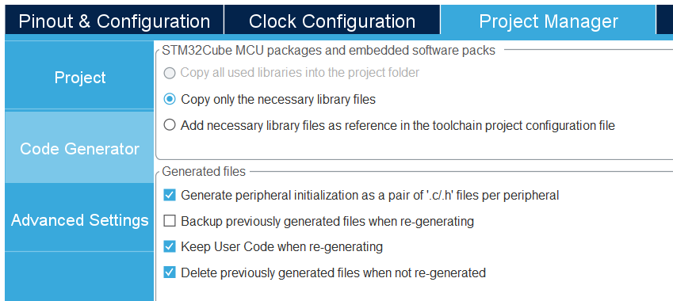

### How to add new MCU interfaces in current architecture

This guide covers, how to extend microcontroller functionaity, using STM32CubeMX code generator.
As an example, firstly will be configured I2C interface.

### Code generation

In first four steps, configure code generator:
 1. Create new project, using repository .ioc file
 2. Enable interface with required setting
 3. [Optional] Enable interrups
 4. Select "Copy only neccessary..." and mark "Generate peripheral as a pair..."




In the next steps, manually will be copied all necessary code parts.
Those are:
 1. Interface handler `I2C_HandleTypeDef hi2cx`
 2. MX init function `MX_I2Cx_Init(void)`
 3. HAL MSP init function `HAL_I2C_MspInit(I2C_HandleTypeDef hi2c)`
 4. Interrupt handlers `I2Cx_EV_IRQ_Handler(void)`, `I2Cx_ER_IRQ_Handler(void)`

From `i2c.h` and `i2c.c` move `I2C_HandleTypeDef hi2cx` and `MX_I2Cx_Init(void)` to the `peripheral.h` and `peripheral.c`


From `i2c.c` move `HAL_I2C_MspInit(I2C_HandleTypeDef hi2c)` to the `stm32f4xx_hal_msp.c`


From `stm32f4xx_it.h` and `stm32f4xx_it.c` (generated) move interrups handlers to the `stm32f4xx_it.h` and `stm32f4xx_it.c` (robotont)


### Implementing interface wrapper

In order to isolate generated stuff with robotont source code, we create simple `ic2if` module. Since we use only goint wrap `HAL_I2C_Mem_Write`. No need to implement stuff, that we don't use currently, it's always can be done in the future.

We will need `init` function to initialize interfaces and `meemoryWrite` to communicate with external devuce, such OLED SSD1306.

```c
void i2cif_init(void)
{
        
    MX_I2C1_Init();
    MX_I2C2_Init();
    MX_I2C3_Init();
}

void i2cif_memoryWrite(I2C_HandleTypeDef *i2c_handler, uint16_t slave_addr, uint16_t mem_addr, uint16_t mem_size,
uint8_t *ptr_data, uint16_t data_size, uint32_t timeout_ms)
{
    (void)HAL_I2C_Mem_Write(i2c_handler, slave_addr, mem_addr, mem_size, ptr_data, data_size, timeout_ms);
}
```

If you don't plan to use interrupts, you are good to go with that implementation. Bt if you planning to use them on the upper levels,
then you need to do few tricks:

 1. Define function pointer, that will be called, when interrupt occurs
 2. Define function, that sets that function pointer. Somewhere in the upper level, use as you need.
 3. When interrupt occurs, this function will be called.

```c
static FunctionPointerType error_callback = NULL; 

void i2cif_setErrorCallback(FunctionPointerType callback)
{
    error_callback = callback;
}

void HAL_I2C_ErrorCallback(FunctionPointerType *i2c_handler)
{
    if (error_callback != NULL)
    {
        error_callback(i2c_handler);
    }
}
```

In this approach, you don't need to import application level stuff to the interface level. Therefore, this module will keps self-compiable and will not depend on other modules.
